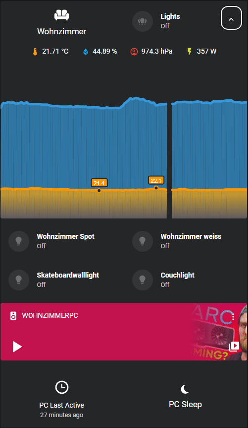
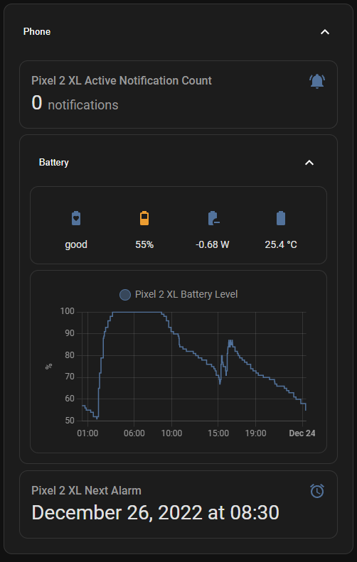
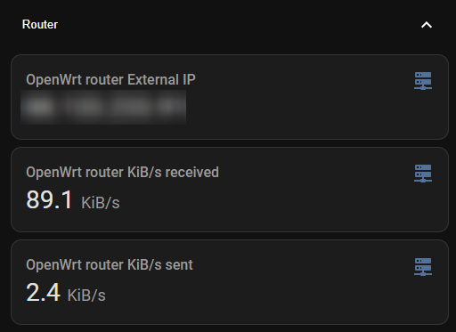
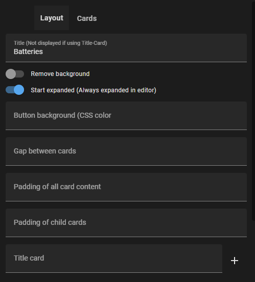

# Expander Card for HomeAssistant


Expander/Collapsible card for HomeAssistant  


Please ⭐️ or sponsor this repo if you find it useful.

## Demo



---

Expand button as overlay:


---

You can even nest expanders!  



---


Clear Background (default theme):  



## Options

**Graphical config supported**




Yaml:

| Name                      | Type     | Default       | Supported options      | Description                                           |
| ------------------------- | -------- | ------------- | ---------------------- | ----------------------------------------------------- |
| type                      | string   | **Required**  | `custom:expander-card` | Type of the card.                                     |
| title                     | string   | _Expander_    | *                      | Title (Not displayed if using Title-Card)             |
| clear                     | boolean  | _false_       | true\|false            | Remove Background                                     |
| expanded                  | boolean  | _false_       | true\|false            | Start expanded                                        |
| button-background         | string   | _transparent_ | css-color              | Background color of expand button                     |
| gap                       | string   | _0.6em_       | css-size               | gap between child cards                               |
| padding                   | string   | _1em_         | css-size               | padding of all card content                           |
| child-padding             | string   | _0.5em_       | css-size               | padding of child cards                                |
| title-card                | object   | **optional**  | LovelaceCardConfig     | Replace Title with card                               |
| title-card-padding        | string   | _0px_         | css-size               | padding of title-card                                 |
| title-card-button-overlay | boolean  | _false_       | true\|false            | Overlay expand button over title-card                 |
| overlay-margin            | string   | _2em_         | css-size               | Margin from top right of expander button (if overlay) |
| cards                     | object[] | **optional**  | LovelaceCardConfig[]   | Child cards to show when expanded                     |

## Installation

### Hacs

Add this repository via HACS Custom repositories

https://github.com/Alia5/lovelace-expander-card

([How to add Custom Repositories](https://hacs.xyz/docs/faq/custom_repositories/))

### Manual
#### 1. Download the card

Install the `expander-card` card by copying `expander-card.js` to `<config directory>/www/expander-card.js`

Bash:

```bash
wget https://github.com/Alia5/lovelace-expander-card/releases/download/latest/expander-card.js
mv expander-card.js /config/www/
```

#### 2. Link the card to your lovelace ui

##### The manual way:

Link `expander-card` inside your `ui-lovelace.yaml`

```yaml
resources:
  - url: /local/expander-card.js
    type: js
```
