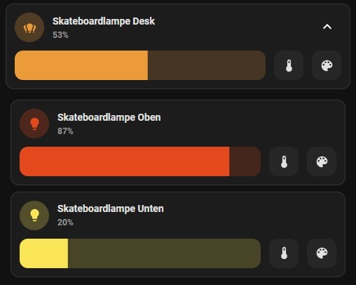

# Expander Card for HomeAssistant

[![release][release-badge]][release-url]
![downloads][downloads-badge]
![build][build-badge]

<a href="https://www.paypal.me/MelleDennis" target="_blank"></a>

<a href="https://www.buymeacoffee.com/melled" target="_blank"></a>


Expander/Collapsible card for HomeAssistant  

## Introduction

First a few words to start with. A big thank you goes to @Alia5 (https://github.com/Alia5/lovelace-expander-card), who initially launched the card. I forked this card for my own HomeAssistant to make a few improvements. I give no guarantee for the functionality and no promise of lifelong maintenance, as I do the whole thing in my free time. Of course, I am happy about every contribution and PR


Please ⭐️ or sponsor this repo when you like it.

## Demo


---

Expand button as overlay:


---

You can even nest expanders!  


---


Clear Background (default theme):  


## Options

**Graphical config supported**


Yaml:

| Name                      | Type     | Default       | Supported options      | Description                                           |
| ------------------------- | -------- | ------------- | ---------------------- | ----------------------------------------------------- |
| type                      | string   | **Required**  | `custom:expander-card` | Type of the card.                                     |
| title                     | string   | Empty         | *                      | Title (Not displayed if using Title-Card)             |
| clear                     | boolean  | _false_       | true\|false            | Remove Background                                     |
| expanded                  | boolean  | _false_       | true\|false            | Start expanded                                        |
| button-background         | string   | _transparent_ | css-color              | Background color of expand button                     |
| gap                       | string   | _0.0em_       | css-size               | gap between cards when expander closed                |
| expanded-gap              | string   | _0.6em_       | css-size               | gap between child cards when expander open            |
| padding                   | string   | _1em_         | css-size               | padding of all card content                           |
| child-padding             | string   | _0.0em_       | css-size               | padding of child cards                                |
| title-card                | object   | **optional**  | LovelaceCardConfig     | Replace Title with card                               |
| title-card-padding        | string   | _0px_         | css-size               | padding of title-card                                 |
| title-card-button-overlay | boolean  | _false_       | true\|false            | Overlay expand button over title-card                 |
| overlay-margin            | string   | _0.0em_       | css-size               | Margin from top right of expander button (if overlay) |
| cards                     | object[] | **optional**  | LovelaceCardConfig[]   | Child cards to show when expanded                     |

## Installation

### HACS

Expander-Card is not available in [HACS][hacs] (Home Assistant Community Store) by default, but you can add it as custom repositories.

1. Install HACS if you don't have it already
2. Open HACS in Home Assistant 
3. Add this repository (https://github.com/MelleD/lovelace-expander-card) via HACS Custom repositories ([How to add Custom Repositories](https://hacs.xyz/docs/faq/custom_repositories/))

[](https://my.home-assistant.io/redirect/hacs_repository/?owner=MelleD&repository=lovelace-expander-card&category=plugin)


### Manual

1. Download `expander-card.js` file from the [latest release][release-url].
2. Put `expander-card.js` file into your `config/www` folder.
3. Add reference to `expander-card.js` in Dashboard. There's two way to do that:
    - **Using UI:** _Settings_ → _Dashboards_ → _More Options icon_ → _Resources_ → _Add Resource_ → Set _Url_ as `/local/expander-card.js` → Set _Resource type_ as `JavaScript Module`.
      **Note:** If you do not see the Resources menu, you will need to enable _Advanced Mode_ in your _User Profile_
    - **Using YAML:** Add following code to `lovelace` section.
        ```yaml
        resources:
            - url: /local/expander-card.js
              type: module
        ```

<!-- Badges -->

[hacs-url]: https://github.com/hacs/integration
[hacs-badge]: https://img.shields.io/badge/hacs-default-orange.svg?style=flat-square
[release-badge]: https://img.shields.io/github/v/release/MelleD/lovelace-expander-card?style=flat-square
[downloads-badge]: https://img.shields.io/github/downloads/MelleD/lovelace-expander-card/total?style=flat-square
[build-badge]: https://img.shields.io/github/actions/workflow/status/MelleD/lovelace-expander-card/build.yml?branch=main&style=flat-square

<!-- References -->

[home-assistant]: https://www.home-assistant.io/
[hacs]: https://hacs.xyz
[release-url]: https://github.com/MelleD/lovelace-expander-card/releases
